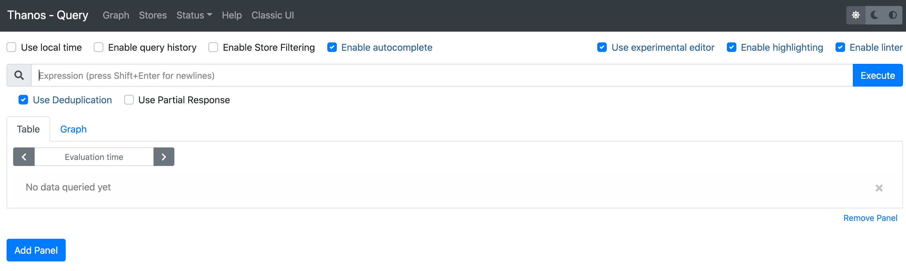
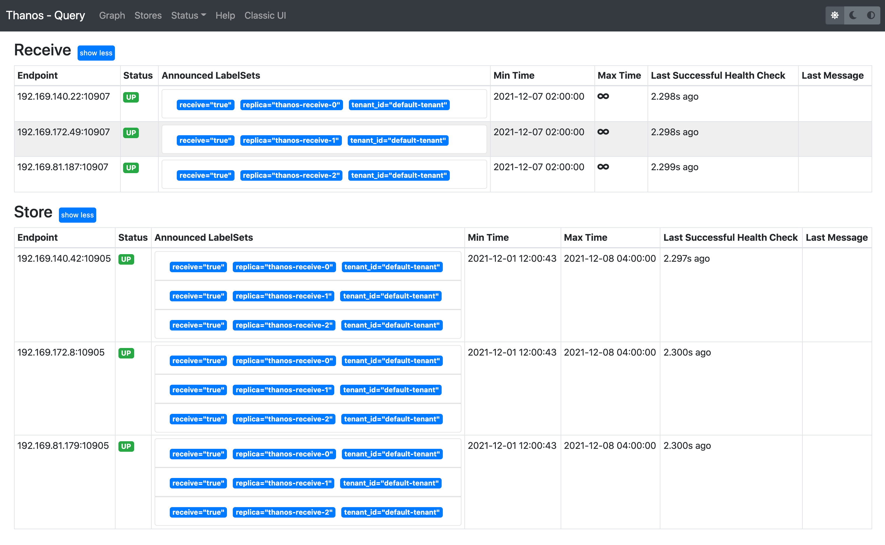
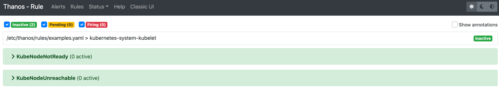
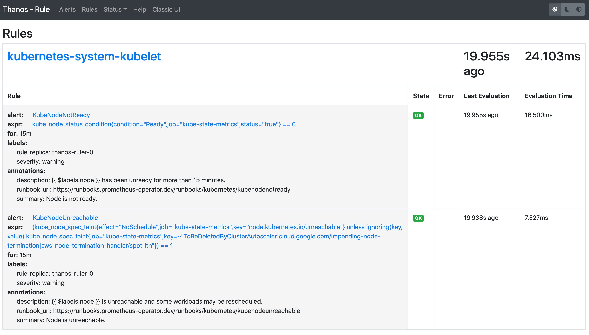
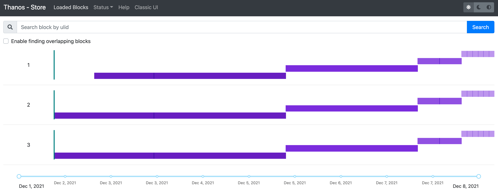
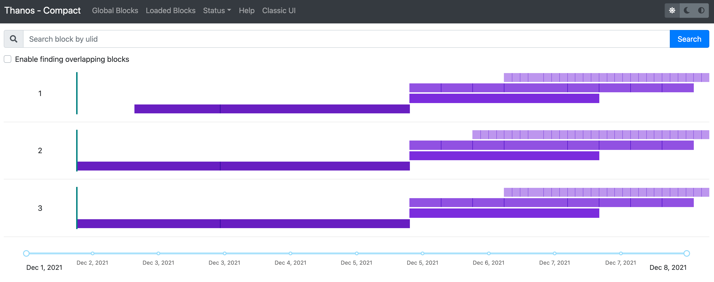
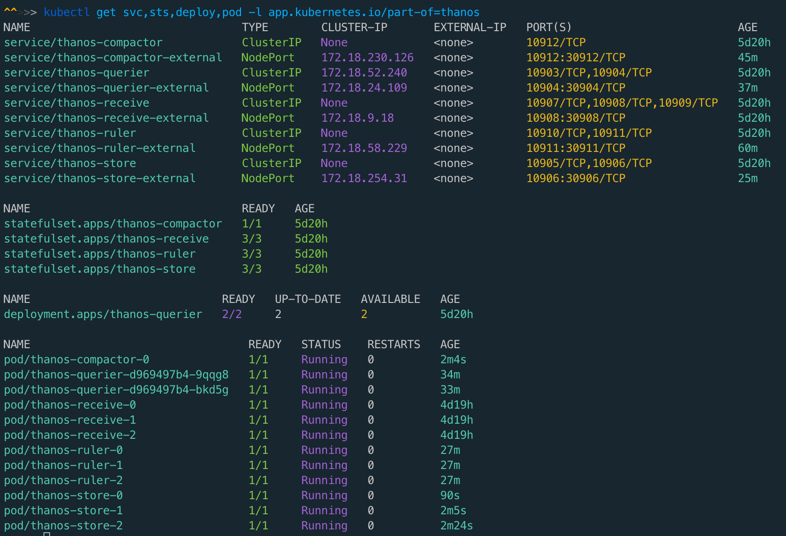

## Introduce
Deploy Thanos in Kubernetes

## All thanos components ports

---

| Component      | Interface               | Port  |
| -------------- | ----------------------- | ----- |
| Sidecar        | gRPC                    | 10901 |
| Sidecar        | HTTP                    | 10902 |
| Query          | gRPC                    | 10903 |
| Query          | HTTP                    | 10904 |
| Store          | gRPC                    | 10905 |
| Store          | HTTP                    | 10906 |
| Receive        | gRPC (store API)        | 10907 |
| Receive        | HTTP (remote write API) | 10908 |
| Receive        | HTTP                    | 10909 |
| Rule           | gRPC                    | 10910 |
| Rule           | HTTP                    | 10911 |
| Compact        | HTTP                    | 10912 |
| Query Frontend | HTTP                    | 10913 |

### grafana add thanos-querier datasource

### thanos-querier web UI

### thanos-ruler web UI

### thanos-store web UI

### thanos-compactor web UI

### All thanos k8s resources

