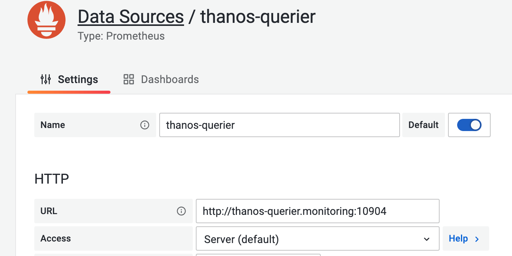
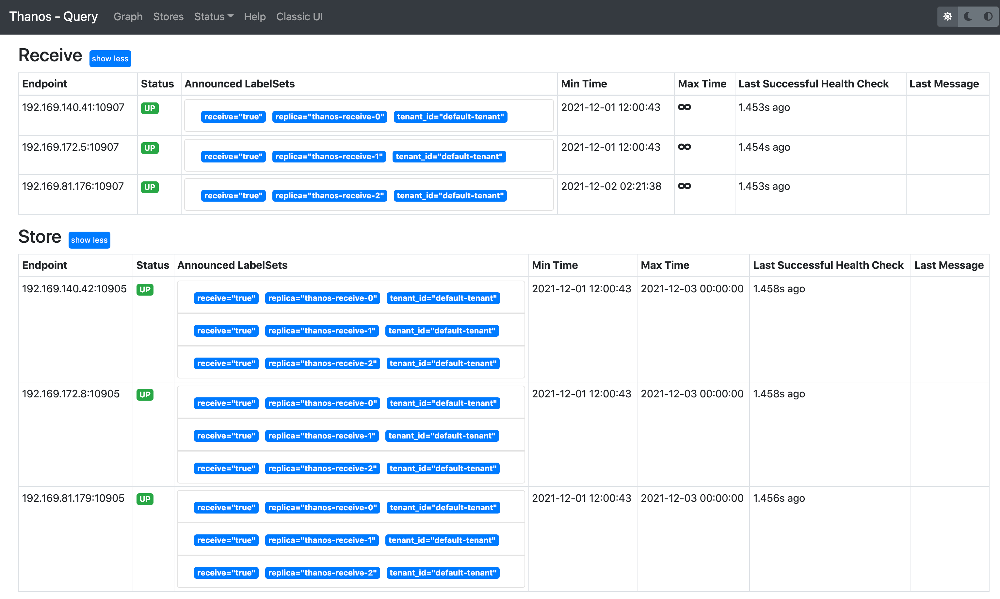
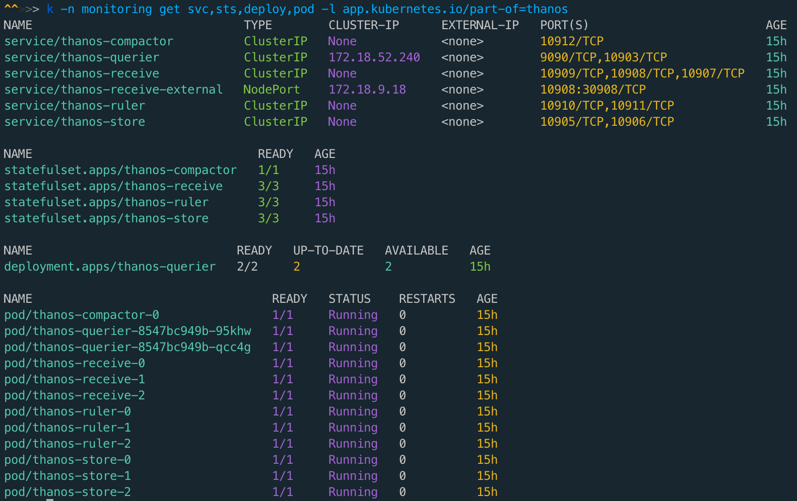

## Introduce
Deploy Thanos in Kubernetes

## All thanos ports

---

| Component      | Interface               | Port  |
| -------------- | ----------------------- | ----- |
| Sidecar        | gRPC                    | 10901 |
| Sidecar        | HTTP                    | 10902 |
| Query          | gRPC                    | 10903 |
| Query          | HTTP                    | 10904 |
| Store          | gRPC                    | 10905 |
| Store          | HTTP                    | 10906 |
| Receive        | gRPC (store API)        | 10907 |
| Receive        | HTTP (remote write API) | 10908 |
| Receive        | HTTP                    | 10909 |
| Rule           | gRPC                    | 10910 |
| Rule           | HTTP                    | 10911 |
| Compact        | HTTP                    | 10912 |
| Query Frontend | HTTP                    | 10913 |

### grafana 添加 thanos-querier 数据源

### thanos-querier 截图

### thanos 相关的 k8s 资源

