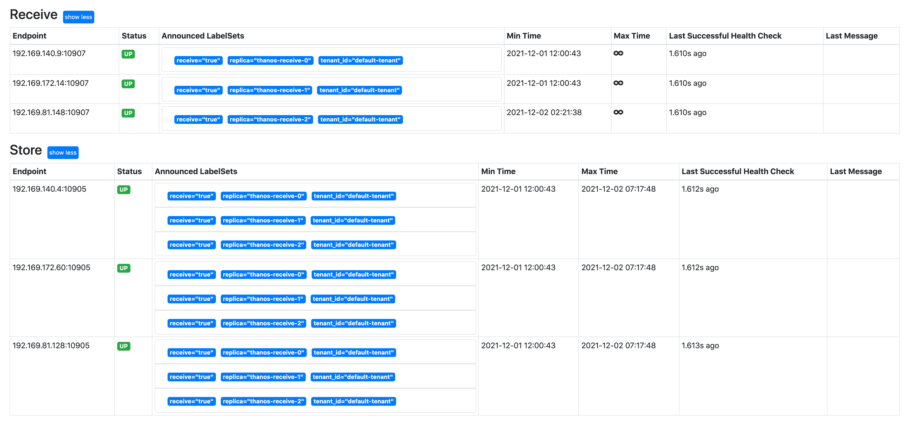
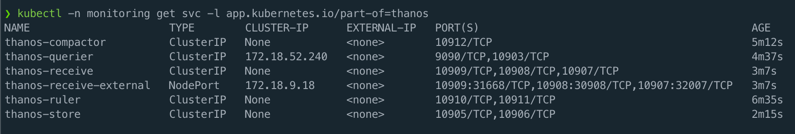
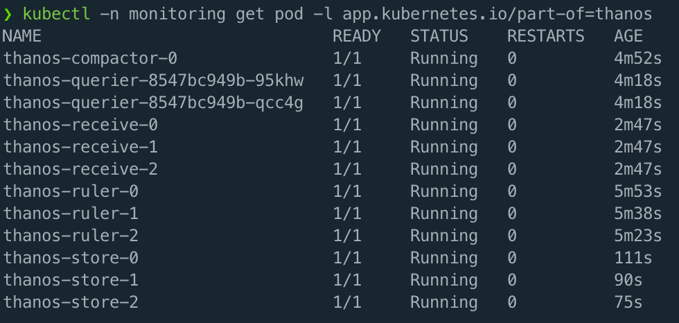

### 1. `prometheus.yaml` 说明了 prometheus 需要修改的内容

### 2. `thanos-objstore.yaml` 指定对象存储 bucket，没有对象存储也可以部署 thanos

### 3. grafana 添加 thanos-querier 数据源

### 4. thanos-querier 截图

### 5. thanos 所有的 pod 和 service

